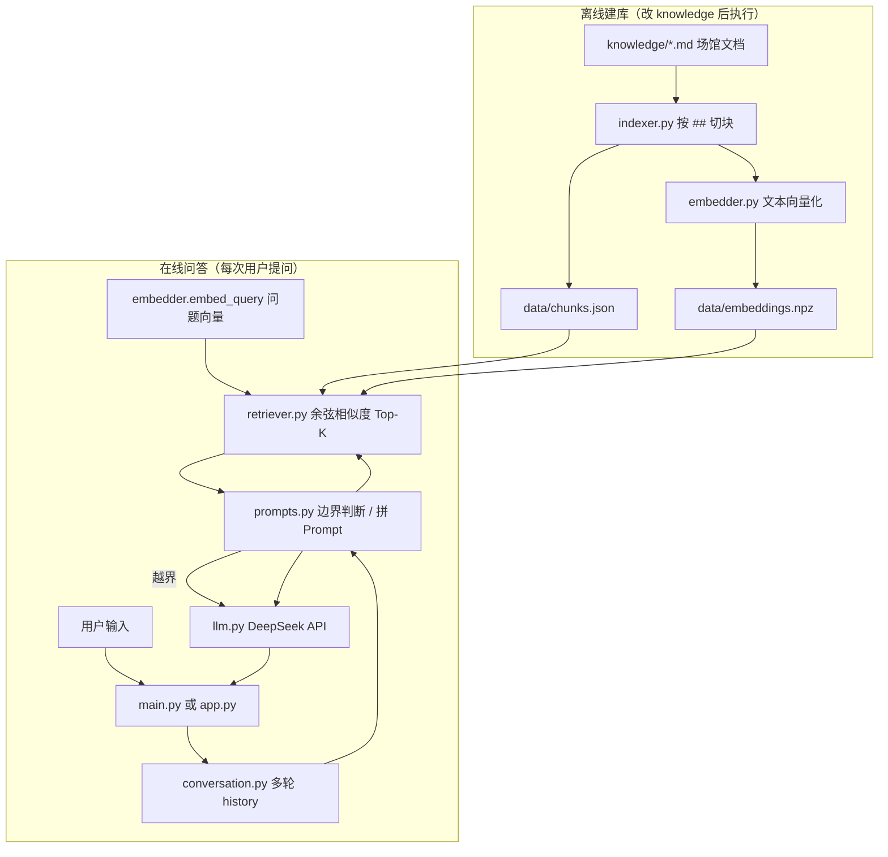

# 实验报告：校园智能场馆匹配平台

## 一、项目背景与目标

### 1.1 背景

校内体育场馆、活动场地种类多（体育馆、游泳馆、羽毛球馆等），容量、设备、预约规则各不相同。学生或社团在组织活动时，往往不清楚「去哪预约、是否要提前申请、能否容纳多少人」，需要在官网、通知、群聊之间反复查找，信息分散且容易过时。

通用大模型（如 DeepSeek）虽能对话，但**不了解本校具体场馆细则**，直接提问容易产生**幻觉**（编造不存在的场馆名、开放时间或预约方式）。

### 1.2 目标

本项目对标课程任务书「方向一：检索 + 大模型问答」，实现 **校园智能场馆匹配平台**：

1. 将本校场馆资料整理为结构化知识库（`knowledge/*.md`）。
2. 用户用自然语言描述需求（活动类型、人数、室内/室外等），系统**先检索再生成**（RAG），给出有据推荐。
3. 支持**多轮对话**（如先推荐场馆，再追问「第二个怎么预约」）。
4. 对**越界问题**（转专业、绩点等）与**库内无记载**情形，明确拒答或说明未记载，不编造。
5. 提供 **CLI**（`main.py`）与 **Gradio 网页**（`app.py`）两种交互方式。

当前测试阶段知识库为 **2 份示例假数据**；正式交付前需替换为 ≥15 份本校场馆文档并重建索引。

---

## 二、技术方案

### 2.1 总体架构（RAG + 语义向量检索）

系统采用 **检索增强生成（RAG）**：用户问题不直接交给大模型，而是先用**语义向量**在知识库中找最相关段落，再把段落与用户问题一并送入 DeepSeek 生成回答。



### 2.2 技术路线图（实施阶段）

| 阶段 | 内容 | 状态 | 主要文件 |
|------|------|------|----------|
| P0 | DeepSeek API 联调、配置与 CLI 骨架 | 已完成 | `llm.py`、`config.py`、`main.py` |
| P1 | 知识库切块、生成 `chunks.json` | 已完成 | `indexer.py`、`knowledge/` |
| P2 | **语义向量索引**（sentence-transformers） | 已完成 | `embedder.py`、`retriever.py`、`data/embeddings.npz` |
| P3 | 多轮对话、边界 Prompt、检索 query 改写 | 已完成 | `conversation.py`、`prompts.py` |
| P4 | CLI 联调与测试用例 | 已完成 | `main.py`、`docs/测试用例.md` |
| P5 | Gradio 网页界面 | 已完成 | `app.py` |
| 待办 | 知识库 ≥15 个本校 `.md`、报告定稿 | 进行中 | `knowledge/`、`docs/实验报告.md` |
| 可选 P6 | 引用标注、有无 RAG 对比实验 | 未做 | — |

### 2.3 核心技术选型

| 模块 | 技术 | 说明 |
|------|------|------|
| 大模型 | **DeepSeek API**（`deepseek-chat`） | 任务书要求；OpenAI 兼容接口 |
| 检索 | **sentence-transformers** | 模型 `paraphrase-multilingual-MiniLM-L12-v2`，支持中文语义匹配 |
| 相似度 | 余弦相似度 + 阈值 `SIMILARITY_THRESHOLD` | 低于阈值视为无命中，防胡编 |
| 备选向量 | TF-IDF（字级 n-gram） | `EMBEDDING_BACKEND=tfidf`，校园网离线开发用 |
| 无向量回退 | 关键词计分 | 无 `embeddings.npz` 时 `retriever` 自动降级 |
| 网页 UI | **Gradio** | 与 CLI 共用 `Conversation`，避免双份业务逻辑 |
| 模型缓存 | HuggingFace 本地 + `EMBEDDING_LOCAL_ONLY` | 校园网可不访问 `huggingface.co` |

### 2.4 项目文件职责说明

| 文件 / 目录 | 作用 |
|-------------|------|
| **`knowledge/*.md`** | 场馆原始资料（每馆一份 Markdown）；任务书要求 ≥15 个文件 |
| **`config.example.py`** | 配置模板（可提交 Git）；含 API、向量、检索阈值等项 |
| **`config.py`** | 本地配置与 **API Key**（`.gitignore`，每人自备） |
| **`indexer.py`** | 扫描 `knowledge/`，按 `##` 标题切块 → `data/chunks.json`；可选同时算段落向量 → `data/embeddings.npz` |
| **`embedder.py`** | 文本向量化：`embed_texts`（建库）、`embed_query`（在线查问）；支持 `sentence_transformers` / `tfidf`；`warmup()` 启动预热 |
| **`data/chunks.json`** | 切块后的段落索引（id、来源文件、标题、正文） |
| **`data/embeddings.npz`** | 每段落的向量矩阵（本机生成，体积大不入库） |
| **`retriever.py`** | **检索入口** `retrieve(query)`：优先向量余弦 Top-K；无索引时关键词回退 |
| **`prompts.py`** | `SYSTEM_PROMPT`、越界关键词 `is_out_of_scope`、`build_retrieval_query`（多轮改写）、`build_rag_user_message`（拼参考资料进 Prompt） |
| **`conversation.py`** | **对话核心** `Conversation.turn()`：维护 `messages` 与 `raw_history`，串联边界 → 检索 → LLM |
| **`llm.py`** | 封装 DeepSeek `chat(messages)`，含重试与 `LLMError` |
| **`main.py`** | 命令行入口：循环读入，`reset` 清空，`warmup()` 后对话 |
| **`app.py`** | Gradio 网页入口：调用同一 `Conversation`，提供发送、清空、示例问题 |
| **`test_*.py`** | 分模块自检（API、检索、边界逻辑） |
| **`docs/`** | 实验报告、协作日志、测试用例、名词解释等 |

### 2.5 一次问答时代码执行流程（详细）

以下以用户输入「我想要去羽毛球馆打羽毛球，想要环境好一点的」为例，说明**各文件如何依次参与**（CLI 与 Gradio 仅在最后一层不同，中间链路相同）。

#### 阶段 A：程序启动（仅一次）

```text
main.py / app.py
  └─ embedder.warmup()
       └─ embed_query("预热")  → 加载 sentence-transformers 到内存
  └─ Conversation()           → prompts.SYSTEM_PROMPT 写入 messages
```

#### 阶段 B：用户发送一句话 → `Conversation.turn(user_input)`

**步骤 1 — 入口与空输入**（`conversation.py`）

- 去掉首尾空格；若为空，直接返回提示，不调 API。

**步骤 2 — 边界预判**（`conversation.py` → `prompts.py`）

- 调用 `is_out_of_scope(user_input)`，用正则匹配「转专业、绩点、选课」等关键词。
- 若越界：返回 `OUT_OF_SCOPE_REPLY`，写入 `messages`，**不调用** `retrieve` 与 DeepSeek 的 RAG 流程（节省费用、避免胡编）。

**步骤 3 — 构造检索 query**（`prompts.py`）

- 调用 `build_retrieval_query(current, raw_history)`。
- 首轮：检索 query ≈ 用户原句。
- 多轮：将上一轮用户问题摘要拼入 query，便于理解「第二个怎么预约」类追问。

**步骤 4 — 语义检索**（`retriever.py` → `embedder.py`）

```text
retrieve(retrieval_q)
  ├─ load_chunks()        读 data/chunks.json
  ├─ load_embeddings()    读 data/embeddings.npz
  ├─ embed_query(query)   embedder：把问题变成 384 维向量
  ├─ scores = matrix @ q_vec   与各段落向量算余弦相似度
  ├─ 按分数排序，过滤 score < SIMILARITY_THRESHOLD
  └─ 返回 Top-K 条 hit（含 source、title、text、score）
```

若无 `embeddings.npz` 或 `USE_VECTOR_INDEX=False`，则走 `_retrieve_keyword` 关键词回退。

**步骤 5 — 拼装 RAG 用户消息**（`prompts.py`）

- `build_rag_user_message(user_input, chunks)`：
  - 有命中：列出「参考资料 1、2…」+ 来源文件名 + 正文片段 + 相似度；
  - 无命中：使用 `NO_CONTEXT_USER_WRAPPER`，明确要求模型**勿编造**。

**步骤 6 — 调用大模型**（`conversation.py` → `llm.py`）

```text
messages.append({"role": "user", "content": user_msg})   # 含 RAG 资料
answer = chat(messages)   # llm.py → DeepSeek API
messages.append({"role": "assistant", "content": answer})
raw_history.append((user_input, answer))   # 供下轮检索改写
return answer
```

**步骤 7 — 展示**

- `main.py`：`print(answer)`
- `app.py`：Gradio 把 `(用户, 助手)` 追加到聊天组件。

#### 多轮与越界（流程差异）

| 场景 | 差异点 |
|------|--------|
| 第 2 轮「15 人需要预约吗」 | `build_retrieval_query` 带上文；`chat` 时 `messages` 含上一轮 assistant，DeepSeek 理解指代 |
| 越界「怎么转专业」 | 步骤 2 直接返回固定话术，跳过步骤 4–6 的检索与 RAG |
| 无命中「火星上的体育馆」 | 步骤 4 返回空列表；步骤 5 用无资料模板；模型按 Prompt 说明未记载 |

---

## 三、实现过程

### 3.1 开发阶段回顾

1. **P0**：搭建项目结构，用 `llm.py` 对接 DeepSeek，完成 `test_llm.py` 与命令行骨架。
2. **P1**：编写 `indexer.py`，将 `knowledge/*.md` 按 `##` 切成段落，输出 `chunks.json`。
3. **P2**：引入 `embedder.py` 与 `sentence-transformers`，建库时为每段计算向量并保存 `embeddings.npz`；改造 `retriever.py` 为**余弦相似度语义检索**（替代早期纯关键词方案）。
4. **P3**：新增 `prompts.py`、`conversation.py`，实现多轮 history、越界规则、检索 query 拼接与 RAG Prompt 模板。
5. **P4/P5**：`main.py` 三轮 CLI 联调；新增 `app.py`（Gradio），网页与终端共用 `Conversation`。

### 3.2 遇到的问题与处理

| 问题 | 处理 |
|------|------|
| 校园网访问 `huggingface.co` 超时 | 配置 `HF_ENDPOINT=https://hf-mirror.com`；模型缓存后设 `EMBEDDING_LOCAL_ONLY=True` 离线加载 |
| 本地缓存 repo_id 与配置短名不一致 | `embedder.py` 自动补全为 `sentence-transformers/模型名` |
| 首次检索很慢 | `main.py` / `app.py` 启动时 `warmup()` 预加载模型 |
| `embeddings.npz` 未入库 | `.gitignore` 排除；队友 clone 后本地执行 `python indexer.py --rebuild` |
| API Key 安全 | 仅本地 `config.py`，仓库只提交 `config.example.py` |

---

## 四、测试与结果

### 4.1 测试环境说明

| 项目 | 说明 |
|------|------|
| 测试时间 | 2026-06-04 |
| 运行方式 | CLI：`python main.py`；网页：`python app.py`（Gradio） |
| 大模型 | DeepSeek API（`deepseek-chat`） |
| 检索 | **`sentence_transformers` 语义向量** + 本地模型缓存（`EMBEDDING_LOCAL_ONLY=True`，启动预热） |
| **知识库** | **假数据 / 示例库**：仅 `knowledge/示例-体育馆.md`、`knowledge/示例-游泳馆.md` 共 2 份占位文档，**非本校真实场馆信息**；正式交付前需替换为 ≥15 份本校资料并 `indexer.py --rebuild` |

### 4.2 CLI 多轮对话实录（`main.py`，示例知识库）

以下三轮为同一次终端会话实录，验证 **语义检索 + RAG 推荐**、**多轮上下文**与 **越界拒答**。


*图 1：`python main.py` 三轮对话（假数据知识库）。*

#### 第 1 轮：场馆推荐（RAG 命中）

**用户：** 我想要去羽毛球馆打羽毛球，想要环境好一点的

**助手：**

> 根据参考资料，本校的羽毛球场地信息如下：
>
> - **位置**：东区体育中心（羽毛球分馆）
> - **容量**：约500人
> - **适用活动**：羽毛球
>
> 该场馆是室内场馆，环境相对较好，适合您打羽毛球的需求。建议您前往东区体育中心羽毛球分馆体验。
>
> 如果您需要更具体的环境细节（如灯光、地板、空调等），参考资料中未记载，建议您联系体育部或场馆管理中心核实。

**观察：** 回答内容与 `示例-体育馆.md` 中「东区体育中心、羽毛球分馆、约 500 人」等字段一致，未编造库外场馆名称。

---

#### 第 2 轮：多轮追问（承接上文，补充预约信息）

**用户：** 我们一共15个人，需要预约吗

**助手：**

> 根据参考资料，羽毛球馆（东区体育中心羽毛球分馆）的预约信息如下：
>
> - **预约方式**：通过校园场馆系统，需提前 **3–7 个工作日** 预约。
> - **容量**：羽毛球分馆约可容纳500人，您15人的团队完全没问题。
>
> 因此，建议您提前通过校园场馆系统预约，以确保有场地可用。如果预约系统具体入口或流程未在资料中说明，建议联系体育部或场馆管理中心核实。

**观察：** 在未重复说明「羽毛球馆」的前提下，系统仍围绕上一轮推荐的东区羽毛球分馆作答，并引用知识库中的预约规则（提前 3–7 个工作日），体现多轮上下文与 RAG 结合。

---

#### 第 3 轮：越界问题（边界处理）

**用户：** 我想转去羽毛球专业，怎么转专业呢

**助手：**

> 您的问题似乎不属于「校园场馆/活动场地」范围，本助手无法根据场馆知识库准确回答。
>
> 我主要负责：场馆推荐、容量与设备、开放时间与预约方式等。
>
> 教务、成绩、选课、转专业等问题请咨询教务处；宿舍问题请咨询学生工作相关部门。如需场馆帮助，请直接描述活动类型、人数与时间。

**观察：** 问题含「转专业」等越界关键词，系统**未调用场馆检索胡编**，而是返回固定边界话术并引导至教务处；符合任务书「库外/非本域不编造」要求。

---

### 4.3 Gradio 网页测试（`app.py`，示例知识库）

**运行**：项目根目录 `python app.py`，浏览器访问 http://127.0.0.1:7860（终端显示 `Running on local URL` 表示服务已启动，按 Ctrl+C 可结束）。

**示例对话**（网页实测）：

- **用户**：我想去打篮球了，想要好一点的场馆，最好提供球的  
- **助手**：推荐东区体育中心室内主场（约 3000 人）；并说明参考资料未记载是否提供用球，建议自备或联系场馆管理方核实。

**观察**：网页与 CLI **共用** `Conversation`，能根据 `示例-体育馆.md` 推荐篮球场地；对库内未记载信息（是否提供球）未编造，符合边界与 RAG 要求。界面支持示例问题一键填入、清空会话、轮次计数。


*图 2：`python app.py` 网页对话（假数据知识库；已进行 2 轮有效对话）。*

---

### 4.4 小结

| 轮次 | 测试意图 | 结果 |
|------|----------|------|
| 1 | 语义向量检索 + 场馆推荐 | 命中示例体育馆资料，推荐合理 |
| 2 | 多轮对话（人数、预约） | 承接上文，引用预约条款 |
| 3 | 边界处理（转专业） | 拒答并提示职责范围 |
| 网页 | Gradio 篮球场馆推荐 | 与 CLI 逻辑一致，未编造「提供用球」 |

**说明：** 因知识库为示例假数据，结论仅证明流程正确；替换本校真实 `knowledge/*.md` 并 `indexer.py --rebuild` 后，应复测并更新图 1、图 2。

---

## 五、总结与展望

### 5.1 收获

1. 完整走通 **RAG 流程**：建库（切块 + 向量）→ 检索 → Prompt 约束 → DeepSeek 生成。
2. 检索由关键词升级为 **sentence-transformers 语义向量**，能更好匹配「羽球 / 羽毛球」等同义表述。
3. 通过 `prompts.py` 与 `conversation.py` 实现**多轮上下文**与**三层边界**（规则越界、无检索命中模板、系统 Prompt 禁止编造）。
4. CLI 与 Gradio **共用 `Conversation`**，保证演示与调试行为一致。

### 5.2 不足

1. 知识库仍为 2 份示例文档，未达任务书 **≥15 个场馆文件** 要求。
2. 多轮检索仅采用「历史拼接 query」，未做 LLM 查询改写（可选优化）。
3. 越界判断为关键词规则，对边界模糊问题可能过严或过松。
4. `embeddings.npz` 需每人本地重建，协作时要注意同步说明。

### 5.3 后续改进

1. 补全本校 `knowledge/*.md` → `indexer.py --rebuild` → 复测并更新报告截图。
2. 完善实验报告背景与答辩演示话术；可选 P6：对比「有/无 RAG」回答差异。
3. 视需要增加引用标注（回答中注明参考资料编号与来源文件）。
